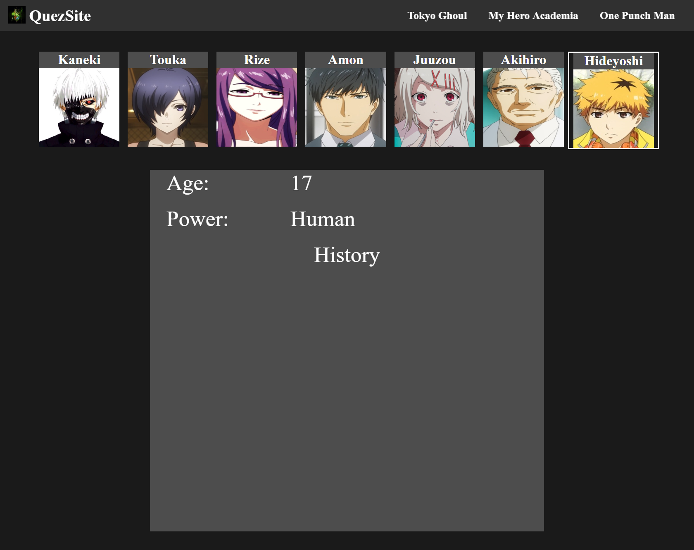

# Anime Character Library

## Description

> Website that allows you to see info about characters from popular animes (No longer being worked on)

## Timeline

> February 2, 2019 - February 3, 2019

## Technology

> * React
> * CSS

## What I learned

> * How to create a website with react
> * npm (node package manager)

## How to install

To view or edit this project, follow these instructions
```
git clone https://github.com/williamj1788/Anime-Character-Library
cd Anime-Character-Library
npm install
npm start
```
The project should open in a new tab

If it doesn't then you can view it on localhost 3000

## Pages

### Home


### Ghoul

